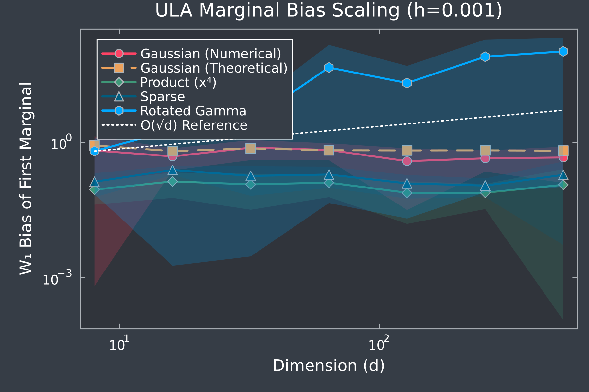
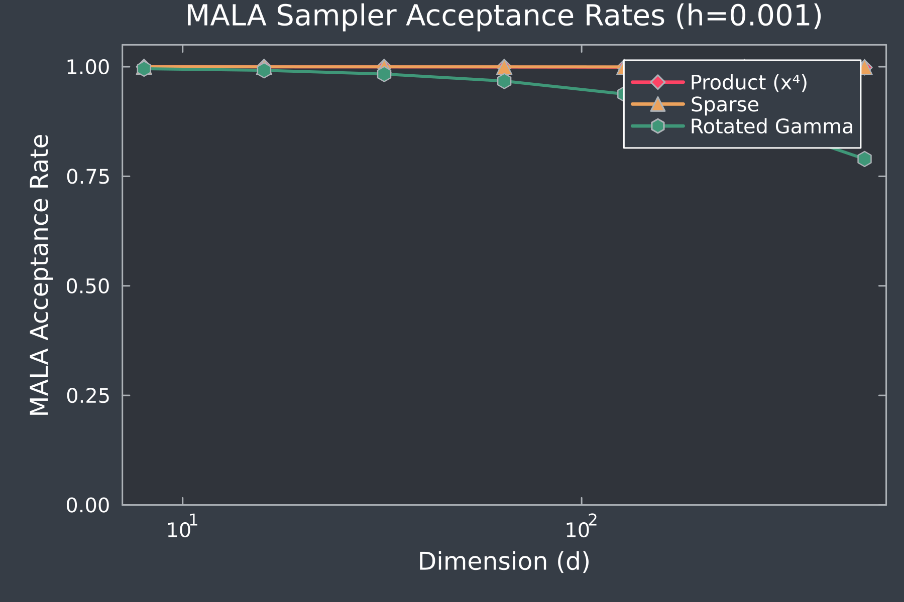
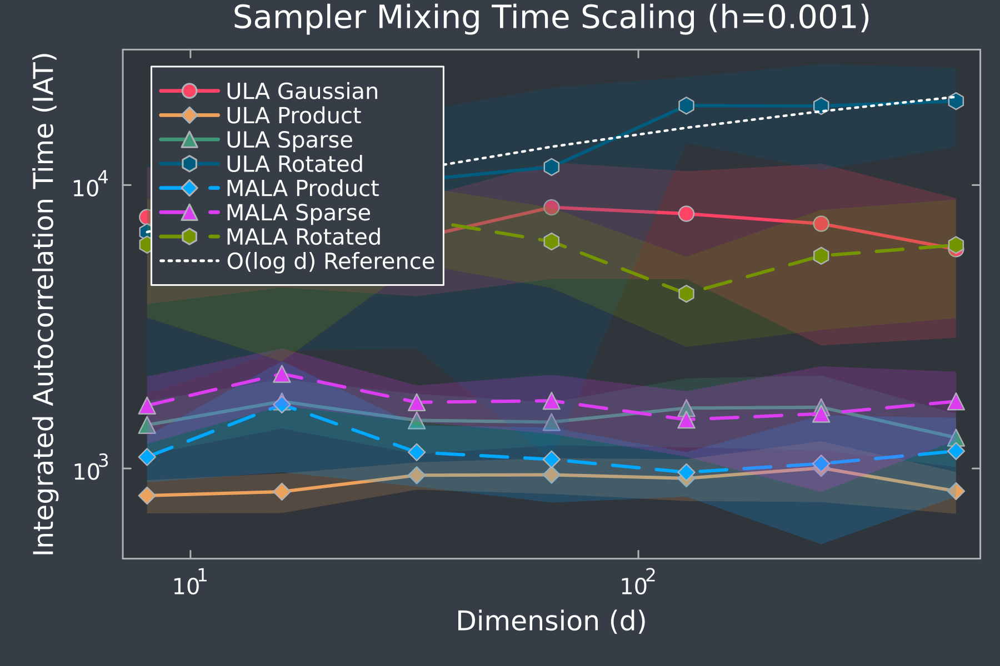

# Experimental Investigation of Bias Delocalization in Unadjusted Langevin Sampling

Yuliang Michael Kang, yk2854@nyu.edu

[](https://julialang.org/downloads/)
[](https://opensource.org/licenses/MIT)

This repository contains the code for an experimental investigation into the "delocalization of bias" phenomenon for high-dimensional probability distributions sampled with Unadjusted Langevin Algorithm (ULA).

### The Key Idea

> For ULA with sparse interactions between marginals (i.e., a sparse Hessian of the drift term, a sparse graphical model) and a Gaussian stationary distribution, the sampling bias on any single marginal is nearly(or completely) independent of the system's total dimension.

## Before you run the project

### 1. Prerequisites

- **Julia:** Ensure you have Julia v1.6 or a later version installed.
- **Julia Packages:** Install the required packages by running the following command in a Julia REPL:

  ```julia
  using Pkg
  Pkg.add([
      "Distributions", "Plots", "ProgressMeter", 
      "StatsBase", "JLD2", "LinearAlgebra", 
      "Random", "Printf"
  ])
  ```

### 2. Running the Experiments

You can run either of the two main experiment scripts from your terminal. Results will be automatically saved to the `results/` directory.

- **To validate the core theory:**
  ```bash
  julia LangevinBiasExperiments_a.jl
  ```

- **To test relaxations of product measures - a stationary distribution governed by potential with strictly diagonal dominant Hessians:**
  ```bash
  julia diagonal_dominance.jl
  ```

---

## Project Structure

The repository is organized as follows:

```
.
├── LangevinBiasExperiments_a.jl  # Main script for theory validation experiments.
├── diagonal_dominance.jl  # Script for exploring relaxed conditions.
├── README.md                     # You are here!
└── results/
    ├── standard
    ├── diag_dominant
```

---

## Results

Upon successful execution, the `results/` directory will contain:

- **`bias_scaling_plot_step-size.png`**: Marginal sampling bias against the model dimension.
- **`acceptance_rates_plot_step-size.png`**: Metropolis-Adjusted Langevin Algorithm (MALA) acceptance rates.
- **`iat_scaling_plot_step-size.png`**: IAT against the model dimension.
- **`raw_data.jld2`**: Unprocessed data from all experimental runs.


## Results Preview:

<p align="center">



</p>